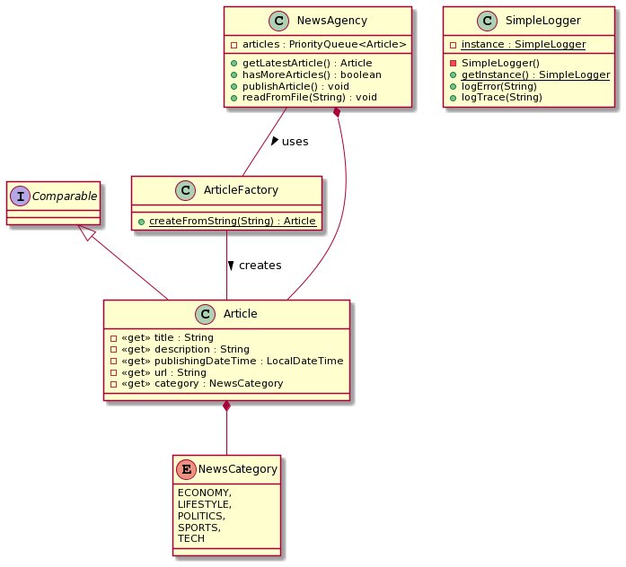

# PROO 3 - Assignment: News Agency

## Objective
Create a program for reading and processing news articles.

## Things To Learn
* Working with _priority queues_.
* Implementing and using a _logger_ based on a _Singleton_ pattern.

## Submission Guidelines
* Via Github Classroom following the assignment acceptance criteria.

## Coding Guidelines
* Package name (of the root package): at.htlleonding.newsagency
* Each source file shall have a file header denoting the application, assignment number, author
* Each class shall have a short API compliant documentation stating its purpose and important things to know.

## Task



In this assignment you are tasked with creating a news agency that is able to publish news articles one at a time - taking care of the oldest ones first. This is to be achieved using a `PriorityQueue`: A specialized queue implementation that returns objects based on their priority, which is determined by their sort order (starting with the lowest one!). You can either use a `Comparator` or implement the `Comparable` interface for the _prioritization_.

A news agency should be able to load articles from a _comma-separated-value_-file by using a static _factory method_ in the class `ArticleFactory`. Erroneous lines - e.g. containing missing values, non-existent categories or wrong dates - and arising exceptions should be ignored. Make sure to _trim_ leading and trailing whitespaces though!

Since we're ignoring exceptions during the loading and parsing, we have no idea what went wrong (or right for that matter) during the execution of our program. This is where we'll use _logging_ - i.e. writing and keeping a record of what happened when during the run time, and how severe it was. Some exemplary lines of such a _log file_ could look like this:

```
2021-11-08 19:36:21 TRACE: Trying to read articles from file "data/kresse.csv".
2021-11-08 19:36:21 ERROR: Exception occured while trying to read lines from file!
2021-11-08 19:36:21 TRACE: Finished trying to read articles from file "data/kresse.csv".
2021-11-08 19:36:21 TRACE: Trying to read articles from file "data/presse.csv".
2021-11-08 19:36:21 TRACE: There are 105 lines. Starting to process each.
2021-11-08 19:36:21 TRACE: Processing line 1.
2021-11-08 19:36:21 TRACE: Trying to parse and create article from line: WAC bezahlt teures Lehrgeld;https://www.diepresse.com/5718741/Europa-League_WAC-bezahlt-teures-Lehrgeld?from=rss;Die Wolfsberger wollen die Hoffnungen aber auch nach dem 0:3 gegen Istanbul Basaksehir nicht aufgeben. Coach Struber: Wir wissen, was wir bewerkstelligen können.;2019-11-08T08:45:00;SPORTS
2021-11-08 19:36:21 TRACE: Parsed all values, creating article.
2021-11-08 19:36:21 TRACE: Returning created article: (SPORTS) WAC bezahlt teures Lehrgeld - veroeffentlicht 08.11.2019 08:45
2021-11-08 19:36:21 TRACE: Adding article to queue.
```

You're going to implement a simple logging functionality in the class `SimpleLogger`:

* The `logError` and `logTrace` methods should format the passed message-`String` as seen above (i.e. including date, time and severity) and append it to a file.
    * You can use the `writeString` method in the `Files`-class - the `StandardOpenOption.APPEND` could be useful for this.
* There are various approaches to creating log files. A popular one is using a log file for each day (e.g. `Log_2021-11-08.txt`). You can also reuse one (constant) file name for this exercise.
* Implement the `SimpleLogger` class using the _singleton pattern_, so that other classes can easily access it.
* Take a look at the provided exemplary log file and try to recreate it by calling the appropriate `log...`-methods to allow better understanding what your code is doing at runtime - and where it runs into problems.

## Hints
### Parsing And Printing Dates And Times
Use the `LocalDateTime` class when working with date and time values in _Java_. You can use a `DateTimeFormatter` to both parse and print a given _moment_. E.g.:

```
LocalDateTime date = LocalDateTime.parse("2019-11-07T17:37:00", 
    DateTimeFormatter.ofPattern("yyyy-MM-dd'T'HH:mm:ss"));
System.out.println(date.format(DateTimeFormatter.ofPattern("yyyy-MM-dd HH:mm:ss")));
```

### Converting A `String` To An _enum_ Value
Use an _enum_'s `valueOf` method, to parse a `String` - note that this throws an `IllegalArgumentException` if no appropriate constant can be found. E.g.: `NewsCategory.valueOf("SPORTS");`
